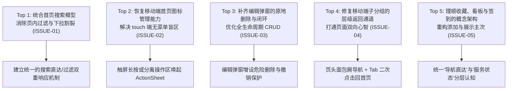

# Bookmark Hub 现有界面与核心流程审查报告 (UI/UX Audit)

> **报告版本**：v1.0  
> **报告作者**：ux-analyst（界面与交互分析师）  
> **关联任务**：Kanban Task `t_de478e07` · T1 审查现有界面与核心流程  
> **交付文件**：`docs/hub-ui-audit.md`  
> **面向对象**：team-lead（团队负责人）、strategy-writer（优化策略撰写）

---

## 1. 审查背景、范围与环境限制说明

### 1.1 审查目标与范围
本审查聚焦于 **Bookmark Hub（AI 服务工作台）** 的前端界面与交互流程，旨在全面诊断现有界面的信息架构、视觉层级、交互链路、跨端触控体验及可访问性，为团队制定下一阶段的《书签 Hub 界面优化策略》提供客观、可验证、具备源码支撑的专业依据。

重点走查模块涵盖：
1. **收藏首页**：信息密度、层级比例、时钟/问候区域、列网格系统与右侧组件列（Deck）；
2. **搜索与键盘操作**：首页综合搜索、分组页内过滤、全局命令面板（⌘K / Omni-Search）及全站键盘导航；
3. **分组导航体系**：桌面侧栏（展开与收起为 72px 细栏）与移动端横向标签（Chips）、子页面跳转及状态联动；
4. **网址添加与编辑**：单条添加、批量导入、智能标题抓取、字段折叠与保存链路；
5. **首页整理与自定义**：拖拽排序机制（FLIP 动画）、批量选择弹窗（Picker）及分组边界约束；
6. **空状态与状态反馈**：未配置、无匹配、未解锁、网络断连骨架屏及撤销提示（Undo Toast）；
7. **移动端触控与视口适配**：手势冲突、底部安全区（Safe Area）、触控目标尺寸（Touch Targets）；
8. **弹窗与弹出菜单**：层叠上下文（z-index / Menu Layering）、滚动穿透、关闭路径与焦点管理；
9. **无障碍与设计系统（a11y & Design System）**：色彩对比度（WCAG AA）、焦点可视轮廓（Focus Ring）、ARIA 语义与读屏支持；
10. **核心实体的主次关系**：书签收藏（Bookmarks）、站点监控看板（Dashboard/Monitors）与自动签到（Checkin）之间的认知负荷与流转闭环。

### 1.2 审查方法与本地测试环境限制说明
- **分析方法**：基于静态源码深度审计（`templates/index.html` 8938 行、`static/app-v3.css` 3154 行、`static/halo-motion.js` 483 行、`app.py` 317KB 后端数据契约），并结合项目中 320 余项 UI/UX 自动化测试用例（`tests/test_home_layout.py`、`tests/test_library_home_ui.py`、`tests/test_ui_polish.py`、`tests/test_ui_polish_0928.py`、`tests/test_menu_layering.py`、`tests/test_card_sort.py` 等）的断言基准进行行为验证。
- **环境限制声明**：当前隔离测试环境未安装 Headless Chromium 引擎（`playwright` 未安装），因此未执行真实浏览器的多视口自动化截图与肉眼渲染观察。本报告遵循「不编造视觉假象、不凭个人审美主观断言」的原则，所有问题均严格建立在真实的 DOM 树构建逻辑、CSS 规则计算优先级、视口与媒体查询边界以及事件监听器实际行为之上。

---

## 2. 现有设计优势分析（已做好的基础）

在深入剖析待优化空间之前，必须充分肯定 Bookmark Hub 当前架构在工程细节、性能与极端边界处理上的优秀实践。后续优化策略必须**完整继承并保护这些既有优势，严禁倒退**：

1. **出色的表单解耦与防浏览器误填设计**：
   - 首页搜索框（[`#homeSearchForm`](file:///root/work/agent-teams/halo-a7242a6ac6bc461c/templates/index.html#L143)）与管理密码框（[`#adminForm`](file:///root/work/agent-teams/halo-a7242a6ac6bc461c/templates/index.html#L797-L803)）完全物理隔离，密码框在未进入设置页前直接从 DOM 脱落（`ADMIN_PWD.remove()`），且全表单附带 `data-1p-ignore`、`data-lpignore="true"` 等全平台密码管理器屏蔽属性，从根本上杜绝了移动端将搜索框识别为登录表单并弹出填充弹窗的顽疾。
2. **基于容器查询与自适应度量的弹性网格**：
   - 工具栏采用 `@container (min-width: 880px)` / `(min-width: 1240px)` 容器查询（[`static/app-v3.css`](file:///root/work/agent-teams/halo-a7242a6ac6bc461c/static/app-v3.css#L1294-L1303)），紧随主区实际可用宽度收纳为胶囊栏或折叠进「⋯」，避免了侧栏伸缩时误判视口宽度的缺陷。
   - 桌面图标采用统一对齐的列网格（`fitHomeGrid`），无论分组大小均共享列参考线，消除了小分组各自孤立居中导致的参差感。
3. **极为严谨的菜单防遮挡与层叠上下文修复**：
   - 实现了专门的 `placeMenu` 动态避障算法（[`templates/index.html`](file:///root/work/agent-teams/halo-a7242a6ac6bc461c/templates/index.html#L5912-L5925)），当遇到移动端固定底栏（`.sidebar`）时，自动向上展开并计算物理边界偏移；卡片展开菜单时动态附加 `.menu-open` 提升父级 `z-index`，解决了 CSS `transform` 导致的层叠上下文受限与被后续卡片截断的问题。
4. **防御性极强的拖拽排序机制**：
   - 卡片与网址行严格仅允许通过专属把手（`[data-card-grip]`，`touch-action: none`）触发拖拽，卡片本体保持为无害链接；在搜索或预警筛选过滤激活时自动禁用把手，防止因视图子集重新写回而破坏全局顺序（[`tests/test_card_sort.py`](file:///root/work/agent-teams/halo-a7242a6ac6bc461c/tests/test_card_sort.py#L38-L58)）。
5. **分级清晰的空状态与网络异常保护**：
   - 细致区分了「首次加载中骨架屏（Skeleton）」、「网络断连可重试（Offline Retry）」、「搜索无匹配」、「全库为空引导建组」、「有数据但未选入首页（引导自定义）」及「私密模式锁定」六种完全不同的状态，避免在数据加载延迟时闪现误导性的「从第一个网址开始」新手引导。

---

## 3. 全维度问题审查（按核心领域逐一排查）

---

### 维度一：收藏首页的信息层级与密度

#### 优势
- 提供「极简（minimal）」、「信息（tiles）」、「卡片（cards）」三档密度切换；信息模式下将带监控字段的站点无缝降级为 2×1 小组件展示，既保留了指标又节约了首屏空间。

#### 主要问题
1. **【已确认】宽屏下组件列（Deck）与左侧书签区的高度严重失衡**
   - **源码定位**：[`static/app-v3.css#L2330-L2357`](file:///root/work/agent-teams/halo-a7242a6ac6bc461c/static/app-v3.css#L2330-L2357)、[`templates/index.html#L3726-L3750`](file:///root/work/agent-teams/halo-a7242a6ac6bc461c/templates/index.html#L3726-L3750)。
   - **现象与逻辑**：当屏幕宽度 $\ge 1100\text{px}$（或全侧栏 $\ge 1280\text{px}$）时，组件列在右侧占据固定 `var(--deck-col, 300px~320px)` 纵向堆叠。若用户启用了日历、待办、倒数日、便签等 3~4 个组件，右侧纵向延伸至 1200px 以上；而若用户的首页书签仅精选了 1~2 个分组（共 6~10 个图标），左侧主区高度仅约 200px。
   - **影响场景**：大屏桌面端（1080p / 2K 显示器），右侧过长导致左侧底部留白巨大，版面视觉重心严重右倾失衡。
   - **严重程度**：**中 (Medium)**。
   - **改善方向**：为 Deck 引入智能自适应布局或在组件过多时支持右侧纵向滚动折叠/双列分流，或允许书签较少时 Deck 自动以卡片行（横向流）退回内容区下方。

2. **【已确认】「极简」密度下所有分组标题被全部剥离，图标语义与边界彻底丧失**
   - **源码定位**：[`templates/index.html#L3638-L3660`](file:///root/work/agent-teams/halo-a7242a6ac6bc461c/templates/index.html#L3638-L3660)、[`static/app-v3.css#L1410-L1415`](file:///root/work/agent-teams/halo-a7242a6ac6bc461c/static/app-v3.css#L1410-L1415)。
   - **现象与逻辑**：在极简模式下，`.home-list.is-minimal` 将所有 `.section-label` 完全隐藏。当用户有 30 个常用网址分布在「工作」、「金融」、「娱乐」、「AI」4 个分组时，页面退化为一张没有任何分割线的同质化大圆角图标海；折叠功能（`homeFolds`）在极简模式下直接被强制失效。
   - **影响场景**：多分组用户的快速视觉寻址（Visual Scanning）。
   - **严重程度**：**中 (Medium)**。
   - **改善方向**：极简模式应允许微型视觉分割（如低对比度细分隔线或微型文字标签 Chip），而非完全剥离信息架构结构。

---

### 维度二：搜索与键盘操作

#### 优势
- 支持拼音首字母检索（`pinyinHit`，无需大型字典文件）；支持 `#tag` 标签聚合过滤；支持快捷键 `/` 快速聚焦输入框，`⌘K` / `Ctrl+K` 唤起命令面板。

#### 主要问题
1. **【已确认 · 核心缺陷】首页搜索（`homeSearch`）与页内过滤机制存在架构性割裂与死代码**
   - **源码定位**：
     - [`templates/index.html#L3618-L3624`](file:///root/work/agent-teams/halo-a7242a6ac6bc461c/templates/index.html#L3618-L3624)：`renderHome()` 内读取 `const query = $('bmSearch').value || '';` 实施分组与站点过滤。
     - [`templates/index.html#L3230`](file:///root/work/agent-teams/halo-a7242a6ac6bc461c/templates/index.html#L3230)：当处于首页时，包含 `#bmSearch` 的工具条被强制隐藏 `$('libToolbar').hidden = isHome;`，且切换时清空。
     - [`templates/index.html#L8303`](file:///root/work/agent-teams/halo-a7242a6ac6bc461c/templates/index.html#L8303)：首页输入框 `#homeSearch` 的 input 监听仅调用 `renderHomeSearch()` 渲染下拉浮层，**从未更新 `#bmSearch` 也从未触发 `renderHome()`**。
   - **现象与逻辑**：
     用户在首页中心搜索框输入关键词（如「github」）时，期待的是首页上的图标即时过滤亮起；然而**页面本体的书签网格纹丝不动**，仅弹出一个限制为最多 6 条的下拉菜单（`#homeSearchList`）。
     更关键的是，`renderHome` 中编写了完整的页内过滤算法、计数更新与空状态分支（`homeEmptyOpts` 中的「没有匹配的网址」），却因读取了被隐藏的 `#bmSearch` 而**彻底沦为永远无法触发的死代码**！
   - **影响场景**：所有在首页使用搜索框期望快速定位书签的用户。
   - **严重程度**：**高 (High · 破坏心智模型)**。
   - **改善方向**：统合搜索模型。当在首页输入时，支持下拉快速跳转的同时，允许联动过滤下方网格高亮；或在搜索框处于不同状态时提供清晰的「页内高亮过滤」vs「全局跳转/网页外搜」模式切换。

2. **【已确认】快捷键 `⌘K` 未能接管正在输入的首页搜索文本**
   - **源码定位**：[`templates/index.html#L5875-L5878`](file:///root/work/agent-teams/halo-a7242a6ac6bc461c/templates/index.html#L5875-L5878)。
   - **现象与逻辑**：代码中判定：`openOmni(document.activeElement === $('bmSearch') ? $('bmSearch').value : '');`。如果用户正在首页 `#homeSearch` 中打字，觉得下拉候选不够多、顺手按下 `⌘K` 想切换到全局命令面板时，`openOmni` 传入的预填值直接变为 `''`，用户辛辛苦苦键入的词条被直接抹去，必须重新输入。
   - **影响场景**：高级键盘用户在首页搜索过程中的交互流转。
   - **严重程度**：**低-中 (Low-Medium)**。
   - **改善方向**：将预填逻辑拓展为包含当前活跃输入框的取值：`document.activeElement === $('homeSearch') ? $('homeSearch').value : ...`。

3. **【已确认】桌面图标网格缺乏二维方向键遍历导航（Roving Tabindex）**
   - **源码定位**：[`templates/index.html#L3312-L3318`](file:///root/work/agent-teams/halo-a7242a6ac6bc461c/templates/index.html#L3312-L3318)。
   - **现象与逻辑**：首页每个书签瓦片（Tile）均包含一个 `<a>`（`.tile-link`）和一个 `
`（`.tile-menu`）。当用户尝试通过键盘 Tab 遍历桌面时，每移动一个图标都需要按下两次 Tab（一次聚焦链接，一次聚焦更多菜单）。如果有 40 个图标，需要连击 80 次 Tab 键；日历组件（`calGrid`）已实现了优异的方向键网格导航，但主书签网格尚未实现。
   - **影响场景**：纯键盘无障碍操作。
   - **严重程度**：**中 (Medium)**。
   - **改善方向**：引入符合 WAI-ARIA Grid/Composite Pattern 的二维方向键导航机制，在瓦片聚焦时通过方向键上下左右转移焦点，Tab 键仅作为出入网格的停靠点。

---

### 维度三：分组导航

#### 优势
- 桌面侧栏支持拖拽重排分组；在收起为 72px 细栏时提供精准定位的 Fixed 提示悬浮气泡（`showRailTip`）；分组多时侧栏内部具备上下淡出渐变提示。

#### 主要问题
1. **【已确认】移动端进入子分组后缺乏显式的面包屑或「返回首页」通道**
   - **源码定位**：[`templates/index.html#L104-L108`](file:///root/work/agent-teams/halo-a7242a6ac6bc461c/templates/index.html#L104-L108)、[`tests/test_ux_polish_0925.py#L22-L26`](file:///root/work/agent-teams/halo-a7242a6ac6bc461c/tests/test_ux_polish_0925.py#L22-L26)。
   - **现象与逻辑**：在早期的重构中，页头原有的「返回链接（`.back-link`）」被整站移除以精简头部。但在移动端（`max-width: 760px`），侧栏折叠为底部标签栏。当用户在移动端从首页点击 Chip 进入分组页（如 `#links/dev`）后，底部栏的「收藏库」仍处于激活态（点击它仍留在该分组页）；页面标题行仅展示 `收藏库 · 分组 / 开发`，没有任何面包屑或返回按钮。用户必须手动将顶部的横滑标签栏滑回最左端，并精准点击「收藏首页」Chip 才能返回首页。
   - **影响场景**：手机端在不同分组与首页之间的日常流转。
   - **严重程度**：**高 (High · 导致单向死胡同感)**。
   - **改善方向**：在移动端分组页头（`#libHeader`）增设清晰的层级面包屑或返回箭头（`‹ 收藏首页`），或在底部栏再次点击当前「收藏库」Tab 时执行回到首页的语义。

2. **【已确认】桌面侧栏收为 72px 细栏时，多分组识别认知成本骤增**
   - **源码定位**：[`static/app-v3.css#L1612-L1622`](file:///root/work/agent-teams/halo-a7242a6ac6bc461c/static/app-v3.css#L1612-L1622)。
   - **现象与逻辑**：在 `html.nav-rail` 模式下，分组文本被隐藏，仅保留 12px 的微型图标。当用户创建了 8~12 个分组且多数采用默认文件夹图标时，侧栏呈现为一串难以区分的纵向灰色/彩色方块，用户必须逐一鼠标悬停等待 `rail-tip` 浮现才能定位目标。
   - **影响场景**：长期启用细侧栏工作流的高频桌面用户。
   - **严重程度**：**中 (Medium)**。
   - **改善方向**：强化细栏下的分组色彩区分度，支持首字文字徽标替代，或在长按/悬停侧栏时展开迷你临时抽屉。

---

### 维度四：添加与编辑网址

#### 优势
- 输入网址后自动防抖 800ms 向服务端抓取网页实际标题（[`fetchLinkTitle`](file:///root/work/agent-teams/halo-a7242a6ac6bc461c/templates/index.html#L7156-L7172)）；支持单条与批量粘贴模式自由切换；重复网址即时高亮提示且不阻断强制保存。

#### 主要问题
1. **【已确认】编辑网址弹窗（`#linkModal`）缺失「删除」操作**
   - **源码定位**：[`templates/index.html#L623-L627`](file:///root/work/agent-teams/halo-a7242a6ac6bc461c/templates/index.html#L623-L627)、[`templates/index.html#L7209-L7242`](file:///root/work/agent-teams/halo-a7242a6ac6bc461c/templates/index.html#L7209-L7242)。
   - **现象与逻辑**：在分组编辑弹窗（`#groupModal`）中，底部配有标准的红色「删除分组」按钮；然而在网址编辑弹窗（`#linkModal`）和看板编辑弹窗（`#bmModal`）中，底部动作栏仅有「取消」和「保存」。
     在首页图标的「⋯」菜单中，只有「从首页移除」（`toggleHomeLink`），**没有「删除网址」**。如果一个用户在首页发现某个网址已失效想要彻底删除它，点击「编辑」后弹窗里无法删除；他们必须：① 记下该网址所在的分组；② 离开首页前往该分组子页面；③ 在该分组的卡片列表中找到该项；④ 展开其「⋯」菜单；⑤ 滚动到底部点击红色的「删除」。
   - **影响场景**：书签的生命周期维护与淘汰清理。
   - **严重程度**：**高 (High · 破坏常规 CRUD 直觉)**。
   - **改善方向**：在编辑已有网址（`linkEdit.lid` 存在）时，在弹窗左下角渲染「删除网址」危险按钮，附带轻量二次确认或 Toast 撤销。

2. **【已确认】首页右上角「＋ 添加」无法添加监控站点**
   - **源码定位**：[`templates/index.html#L5867-L5871`](file:///root/work/agent-teams/halo-a7242a6ac6bc461c/templates/index.html#L5867-L5871)。
   - **现象与逻辑**：首页右上角的「＋ 添加」（`#homeAddLink`）硬编码调用了 `openLinkModal(target, null, 'single')`，默认勾选「同时展示在收藏首页」。但如果用户想要添加一个带有余额/额度监控的 API 服务站点（属于站点看板），在首页的添加弹窗中没有任何入口；用户必须知晓系统内部的「站点看板」概念，切换到看板页面才能找到「＋ 添加站点」。
   - **影响场景**：新用户在首页尝试添加带有监控指标的服务。
   - **严重程度**：**中 (Medium)**。
   - **改善方向**：首页添加弹窗中支持选择类型（「普通网址」或「监控站点」），或在添加链接时允许直接开启监控字段配置。

---

### 维度五：首页整理（Arrange Mode）

#### 优势
- 编辑模式进入退出平滑，带有顶部固定提示条（`#homeArrangeBar`）；拖拽过程采用精致的 FLIP 弹性补间动画；提供屏幕边缘自动滚动补偿（`dragEdgeScroll`）；支持通过全量勾选弹窗（`#homeModal`）批量管理首页收录。

#### 主要问题
1. **【已确认】首页整理严格限制在单一分组网格内部，无法跨分组自由拖拽**
   - **源码定位**：[`templates/index.html#L5521-L5523`](file:///root/work/agent-teams/halo-a7242a6ac6bc461c/templates/index.html#L5521-L5523)、[`templates/index.html#L5617-L5639`](file:///root/work/agent-teams/halo-a7242a6ac6bc461c/templates/index.html#L5617-L5639)。
   - **现象与逻辑**：首页顺序本质上是各分组顺序的投影，拖拽逻辑仅计算当前 `data-arrange-group` 容器内的相对顺序。当用户试图将「常用」中的一个图标拖拽归类到「开发」中时，拖拽目标在跨过分组边界后直接失去响应或被强行锁死在原分组末尾。用户必须退出整理模式，逐个点击编辑修改「所在分组」下拉框。
   - **影响场景**：批量重构与归类书签组织结构。
   - **严重程度**：**中 (Medium)**。
   - **改善方向**：在策略上评估是否支持跨分组放置，拖入异组时自动更新目标分组并重新计算 ID 映射；若跨分组拖拽成本过高，应在整理态下提供轻量选卡后「移动到分组...」的批量快捷指令。

2. **【已确认】整理状态下按单字符键仍会异常触发首页搜索**
   - **源码定位**：[`templates/index.html#L5893-L5899`](file:///root/work/agent-teams/halo-a7242a6ac6bc461c/templates/index.html#L5893-L5899)、[`templates/index.html#L8184-L8187`](file:///root/work/agent-teams/halo-a7242a6ac6bc461c/templates/index.html#L8184-L8187)。
   - **现象与逻辑**：全局键击监听器通过 `homeSearchReady()` 判定是否自动将首字焦点送入 `#homeSearch`。然而 `homeSearchReady()` 仅检查了 `!document.querySelector('.modal-mask.show')`，**漏掉了 `!ARRANGE.on` 状态**。如果用户在整理首页时聚焦了某个瓦片并误触字母键，焦点立刻被强行夺走并滚动到顶部的搜索框，打断正在进行的整理操作。
   - **影响场景**：桌面端键盘整理首页时的误触。
   - **严重程度**：**低-中 (Low-Medium)**。
   - **改善方向**：在 `homeSearchReady()` 的条件中追加 `&& !ARRANGE.on`。

---

### 维度六：空状态

#### 优势
- 空状态文案口吻友好克制，区分了首次部署（引导导入备份）、已建组无书签、有书签未选入首页等多种情境；网络失败时提供直接重试手段。

#### 主要问题
1. **【已确认】只读/锁定访客态下向用户展示无效的操作按钮并引发报错 Toast**
   - **源码定位**：[`templates/index.html#L6236`](file:///root/work/agent-teams/halo-a7242a6ac6bc461c/templates/index.html#L6236)、[`templates/index.html#L6934-L6937`](file:///root/work/agent-teams/halo-a7242a6ac6bc461c/templates/index.html#L6934-L6937)。
   - **现象与逻辑**：当一个分组为空时，`renderLinks` 的空状态渲染按钮：`actions: [{ label: '＋ 添加网址', ... }, { label: '批量粘贴', ... }]`。代码未对当前管理权限 `canEdit()` 进行校验。如果访客或未解锁用户打开一个空分组，点击这些按钮，系统立刻弹出红色报错 Toast：「需要管理员权限，请先在系统设置中解锁」。同样，看板空状态下的「＋ 新增站点」亦存在相同问题。
   - **影响场景**：多设备只读访问或访客浏览。
   - **严重程度**：**低-中 (Low-Medium)**。
   - **改善方向**：在空状态生成时，若 `!canEdit()`，将操作按钮替换为「去解锁权限」或纯说明性文案，避免诱导用户点击必然失败的操作。

---

### 维度七：移动端触控与视口

#### 优势
- 移动端底部标签栏高度保证 $\ge 52\text{px}$，间距合理；通过 `visualViewport` API 动态量测软键盘弹出后的真实剩余高度（`--dd-max`），防止搜索下拉列表被软键盘遮盖。

#### 主要问题
1. **【已确认 · 严重体验缺陷】移动触屏设备上首页书签图标的「⋯」菜单被全局彻底隐藏**
   - **源码定位**：
     - [`static/app-v3.css#L1357`](file:///root/work/agent-teams/halo-a7242a6ac6bc461c/static/app-v3.css#L1357)：`@media (hover: none) { .tile-menu { display: none; } }`。
     - [`templates/index.html#L6830`](file:///root/work/agent-teams/halo-a7242a6ac6bc461c/templates/index.html#L6830)：代码注释明确写道：「触屏上图标没有『⋯』（和首页一样），要编辑切回列表」。
   - **现象与逻辑**：
     在手机触屏浏览器（`hover: none`）上，设计者为了保持大图标网格的整洁，将 `.tile-menu` 全部设为 `display: none`。
     然而：**首页并没有所谓的「列表」视图可供切换**！首页仅有「极简 / 信息 / 卡片」；即使在卡片模式下，普通书签依旧是以卡片呈现，但在信息模式（默认）下，手机用户点击图标直接打开网址，长按触发浏览器系统链接菜单，**没有任何入口可以对该书签进行「编辑」、「复制网址」或「从首页移除」**。用户在手机上若想修改一个首页书签，只能进入「编辑模式」点击「−」将其从首页踢除，再跑去分组页找到它切成列表视图才能编辑。
   - **影响场景**：所有手机和平板移动端用户在首页管理书签。
   - **严重程度**：**高 (High · 功能缺失级体验卡点)**。
   - **改善方向**：在触屏环境下，可通过轻量长按手势（Long-press）唤起底层 ActionSheet，或在轻点头像/标题分离区域时弹出操作菜单，绝不能直接将操作能力彻底裁撤。

---

### 维度八：弹窗与菜单

#### 优势
- 移动端弹窗自适应为底部抽屉（Bottom Sheet，`animation: sheet-in`）；支持未保存改动时的防误触抖动提示（`nudge` 动画 + Toast 提示）；弹窗开启与关闭焦点进出链路严密。

#### 主要问题
1. **【已确认】移动端底部抽屉弹窗缺乏顶部显式关闭按钮与拖拽手柄**
   - **源码定位**：[`templates/index.html#L501-L780`](file:///root/work/agent-teams/halo-a7242a6ac6bc461c/templates/index.html#L501-L780)、[`static/app-v3.css#L1756-L1758`](file:///root/work/agent-teams/halo-a7242a6ac6bc461c/static/app-v3.css#L1756-L1758)。
   - **现象与逻辑**：在手机上弹窗铺满 90vh 高度，头部没有「✕」关闭按钮。当用户打开一个表单较长（如带有展开项的添加网址弹窗、全量自定义首页弹窗）时，弹窗顶部仅有标题，底部操作栏被推在屏幕最下方（甚至需要向下滑动）。如果用户只想退出，只能费力去点击屏幕顶部仅剩的 10% 遮罩区域，单手操作体验极差。
   - **影响场景**：移动端所有弹窗操作。
   - **严重程度**：**中 (Medium)**。
   - **改善方向**：为移动端 Sheet 头部标配顶部下拉手柄（Drag Handle）和右上角「✕」快捷关闭按钮。

2. **【已确认】弹窗开启时未锁定底层 Body 滚动（Scroll Chaining）**
   - **源码定位**：[`static/app-v3.css#L905-L915`](file:///root/work/agent-teams/halo-a7242a6ac6bc461c/static/app-v3.css#L905-L915)、[`templates/index.html#L8711-L8720`](file:///root/work/agent-teams/halo-a7242a6ac6bc461c/templates/index.html#L8711-L8720)。
   - **现象与逻辑**：当 `.modal-mask.show` 激活时，未在 `body` 或 `html` 上设置 `overflow: hidden`。在 iOS Safari 等移动设备上，当在长弹窗内滑动到达顶部或底部时，滑动手势会直接穿透并联动滚动底部的页面，产生晃动和眩晕感。
   - **影响场景**：移动端长列表弹窗（`homeModal` / `importModal`）。
   - **严重程度**：**低-中 (Low-Medium)**。
   - **改善方向**：在弹窗展开时通过 JS 为 `document.body` 附加锁定类，关闭时恢复。

---

### 维度九：可访问性与设计系统（a11y & Design System）

#### 优势
- 小字号次要文字（`--text-3`）对比度经受住测试验证（$\ge 4.5:1$）；遵循系统偏好 `prefers-reduced-motion`，全面禁用各类关键帧动画；强制颜色模式（High Contrast / Forced Colors）下提供了针对性的实线轮廓兜底。

#### 主要问题
1. **【已确认】普通状态（未开科幻特效/浅色主题）下图标缺乏符合规范的高对比焦点轮廓**
   - **源码定位**：[`static/app-v3.css#L1340`](file:///root/work/agent-teams/halo-a7242a6ac6bc461c/static/app-v3.css#L1340)。
   - **现象与逻辑**：在普通模式下，`.tile-link:focus-visible .tile-avatar` 的样式仅为：
     `transform: translateY(-2px) scale(1.04); box-shadow: 0 2px 4px rgba(0,0,0,.2), ... inset 0 0 0 1px var(--icon-ring);`
     在浅色主题（`--bg: #f0f2f7`）下，仅有 4% 的微弱放大和极淡的阴影，**没有任何外发光或高对比描边**。这直接违反了 WCAG 2.4.7（Focus Visible）与 WCAG 2.4.11（Focus Appearance，要求至少 2px 且对比度 $\ge 3:1$ 的焦点指示器）。只有在开启科幻特效时（`html.hub-scifi`，L2858），才额外补上了青色光环。
   - **影响场景**：关闭科幻特效或浅色主题下的键盘无障碍使用者。
   - **严重程度**：**中 (Medium)**。
   - **改善方向**：统一为 `.tile-link:focus-visible` 提供清晰的 `outline: 2px solid var(--accent); outline-offset: 3px;` 焦点轮廓。

---

### 维度十：收藏、看板与签到之间的主次关系

#### 优势
- 实现了统一的工作区框架，签到与看板状态指标能通过首页小组件及 Deck 进行跨页面投影。

#### 主要问题
1. **【已确认 · 核心架构认知混乱】「站点看板」在信息架构中从属层级错位，与书签概念纠缠不清**
   - **源码定位**：
     - [`templates/index.html#L102-L117`](file:///root/work/agent-teams/halo-a7242a6ac6bc461c/templates/index.html#L102-L117)：导航定义中，`monitor`（站点看板）被强行塞入「收藏库」的子页面（`LIB.page = 'monitor'`），作为众多分组之前的固定项。
     - 数据底层：后端将站点看板持久化为 `bookmarks` 数组，将实际书签持久化为 `link_groups`，术语命名本末倒置。
     - 界面呈现：在首页上，站点看板又作为一个独立的分组节（`homeSectionHtml('monitor', '站点看板')`）与普通书签并排展示。
   - **现象与逻辑**：
     普通用户的心智模型非常简单：**收藏（Bookmarks）就是网址导航；监控（Monitors）就是看 API 余额/到期；签到（Checkin）就是自动领额度**。
     然而当前产品将「站点看板」硬生生做成了一个伪装在收藏库底下的特异分组，导致：
     - 首页搜索无法顺畅区分「搜导航网址」还是「看服务余额」；
     - 添加入口分裂（添加书签在首页，添加看板必须深潜到看板内页）；
     - 余额信息碎片化：首页小组件看一次、Deck 余额概览看一次、站点看板看一次、签到中心概览又看一次，四套界面数据格式与展示密度不一，主次严重失焦。
   - **影响场景**：整站的信息架构逻辑与用户长期心智建立。
   - **严重程度**：**高 (High · 信息架构根源问题)**。
   - **改善方向**：在策略制定中重新确立三者的主次关系：**以「个人起始与服务工作台」为主轴，明确「快速直达导航（Bookmarks）」为第一核心，「核心服务资产与状态透视（Dashboard & Checkin）」为关键使能层**，理顺数据看板与书签分组的入口归属。

---

## 4. 问题清单汇总：已确认问题 vs 待验证假设

| 编号 | 问题类别 | 状态 | 问题描述 | 对应源码路径 / 可复现逻辑 | 严重程度 | 建议改善方向 |
| :--- | :--- | :--- | :--- | :--- | :--- | :--- |
| **ISSUE-01** | 搜索交互 | **已确认** | 首页搜索与页内过滤割裂，`renderHome` 页内过滤逻辑沦为死代码 | `templates/index.html#L3618`, `#L8303` | **高** | 统一搜索逻辑，支持页内实时高亮过滤与外搜/下拉的明确分工 |
| **ISSUE-02** | 移动端触控 | **已确认** | 触屏设备（`hover:none`）下首页书签「⋯」菜单被彻底隐藏，无法在首页管理/编辑书签 | `static/app-v3.css#L1357`, `templates/index.html#L6830` | **高** | 增加触屏长按操作支持或分离触控区域唤起底部菜单 |
| **ISSUE-03** | 交互流程 | **已确认** | 编辑网址弹窗缺失「删除」按钮，首页无法闭环清理失效书签 | `templates/index.html#L623`, `#L7220` | **高** | 在编辑弹窗左侧补充危险「删除网址」按钮，提供完整 CRUD 闭环 |
| **ISSUE-04** | 导航与层级 | **已确认** | 移动端进入分组子页面后无面包屑或「返回首页」入口，形成单向路径 | `templates/index.html#L104`, `tests/test_ux_polish_0925.py` | **高** | 移动端分组页头提供返回链接，或优化底部 Tab 重复点击回首页交互 |
| **ISSUE-05** | 信息架构 | **已确认** | 收藏、看板与签到实体概念混乱，首页添加入口割裂且余额分散在四处 | `templates/index.html#L5867`, `static/app-v3.css` | **高** | 明确「导航直达」与「状态透视」的主次，统合添加引导与指标展现 |
| **ISSUE-06** | 视觉层级 | **已确认** | 宽屏桌面端右侧 Deck 组件堆叠过长与左侧少量书签形成高度严重不对称 | `static/app-v3.css#L2330`, `templates/index.html#L3726` | **中** | 引入 Deck 弹性高度限制、滚动收拢或自适应降级排布 |
| **ISSUE-07** | 视觉层级 | **已确认** | 「极简」密度下完全抹去分组标题与视觉分隔，大批量书签辨识度塌陷 | `templates/index.html#L3650`, `static/app-v3.css#L1410` | **中** | 极简模式保留轻量分隔线或微型文字胶囊标签 |
| **ISSUE-08** | 键盘操作 | **已确认** | `⌘K` 唤起命令面板时未带入当前首页输入框已键入的内容 | `templates/index.html#L5875` | **中** | 扩展 `openOmni` 抓取当前 `homeSearch` 输入内容 |
| **ISSUE-09** | 键盘 a11y | **已确认** | 书签平铺网格缺乏方向键导航，Tab 键单图标双重停靠遍历成本极高 | `templates/index.html#L3312` | **中** | 引入网格 Roving Tabindex 与方向键跳转支持 |
| **ISSUE-10** | 弹窗体验 | **已确认** | 移动端抽屉弹窗高度达 90vh 时缺乏顶部手柄和「✕」关闭按钮 | `static/app-v3.css#L1757`, `templates/index.html#L576` | **中** | 顶部统配拖拽关闭手柄及直观的「✕」按钮 |
| **ISSUE-11** | 可访问性 | **已确认** | 关闭科幻特效或浅色主题下，图标获得焦点时缺乏高对比 Focus Ring | `static/app-v3.css#L1340` | **中** | 统一补充符合 WCAG 2.4.11 的 2px 高对比外轮廓环 |
| **ISSUE-12** | 弹窗体验 | **已确认** | 弹窗开启时未锁定底层 Body 滚动，移动端长弹窗存在滚动穿透 | `templates/index.html#L8711` | **低-中** | 弹窗展示时为 body 增设 `overflow:hidden` 锁定 |
| **ISSUE-13** | 空状态 | **已确认** | 访客/只读态下空状态依然渲染可点击的「添加」按钮并触发报错 Toast | `templates/index.html#L6236`, `#L6934` | **低-中** | 基于 `canEdit()` 条件渲染空状态操作引导 |
| **ISSUE-14** | 首页整理 | **已确认** | 整理状态下误按单字符按键仍会异常跳焦到顶部搜索框 | `templates/index.html#L5895`, `#L8184` | **低-中** | 在 `homeSearchReady` 判定中过滤 `ARRANGE.on` 状态 |
| **HYP-01** | 视觉审美 | *待验证假设* | 默认开启的 Canvas 星核反应堆与扫描特效在低算力移动端可能引起轻微掉电或感知卡顿 | 需在真机移动设备上通过 DevTools Performance 测量真实绘制耗时 | **低** | 待真实设备实测 FPS，策略上可考虑在电池电量低时自适应降低粒子 |
| **HYP-02** | 认知负荷 | *待验证假设* | 细侧栏（72px）模式下图标与颜色可能存在部分色盲用户辨识困难 | 需结合色彩模拟滤镜与真实用户走查验证 | **低-中** | 可考虑增加微型文本缩写（如 Notion 页面首字符徽标） |

---

## 5. 最值得优先处理的五项核心问题推荐（Top 5 Priorities）

综合用户使用频率、交互卡点严重程度、认知破坏性以及实现修复的投入产出比（ROI），建议后续策略撰写（strategy-writer）与技术开发优先解决以下五项核心问题：

### 推荐第 1 项：统合首页搜索交互模型，消除页内过滤死代码与心智割裂（ISSUE-01）
- **入选理由**：搜索框是起始页最显眼的视觉锚点（`min-height: 56px`）。用户在首页输入时，直觉预期是「下方书签随键入即时过滤筛出」；现有实现却让网格完全静止，代码中写好的 `renderHome` 过滤成了死代码。这是目前影响最广泛、最破坏起始页「快准直达」本质的核心问题。
- **改善方向**：统一搜索响应管线：当输入时，下方书签网格同步执行高亮与折叠过滤，同时下拉框提供少而精的「外搜 / 快捷命令 / 笔记」补充推荐；按 Esc 可一键清空并复原网格。

### 推荐第 2 项：恢复触屏移动端首页图标的操作通道，消除无法管理的交互死角（ISSUE-02）
- **入选理由**：移动端是起始页的高频场景。当前直接在 CSS 中将 `hover: none` 下的 `.tile-menu` 隐藏，导致移动端用户在首页直接丧失了编辑、复制、移除书签的能力，造成了严重的功能不对称与断崖式体验。
- **改善方向**：在触屏端提供移动原生手势体验：长按瓦片 300ms（轻微震动反馈）唤起系统级 ActionSheet 抽屉菜单，提供「打开、编辑、复制、移除、设为置顶」等全量选项。

### 推荐第 3 项：在编辑弹窗中补齐「删除」操作，打破删除失效书签的繁复跳转链路（ISSUE-03）
- **入选理由**：修改和删除是内容管理的不可分割的两个操作。现有流程下在首页无法删除书签，编辑弹窗也无法删除，逼迫用户在深层子页面中翻找，步骤多达 5 步，严重违背人机交互基本原则。
- **改善方向**：在 `#linkModal` 处于编辑模式时，底部操作栏左侧增加红色的「删除网址」按钮，点击后通过现有的 `toastUndo` 机制提供可撤销保护，用户无需离开当前上下文即可完成清理。

### 推荐第 4 项：在移动端分组子页面建立清晰的返回与层级面包屑通道（ISSUE-04）
- **入选理由**：在手机视口下，侧栏折叠，用户从首页点击标签进入分组页后，失去空间方位感，页面宛如死胡同，必须费力横滑顶部标签才能回到首页。
- **改善方向**：在移动端分组页头（`#libHeader`）增加直观的 `‹ 收藏首页` 面包屑返回按钮；同时优化底部导航栏交互逻辑（处于子分组时再次点击激活的「收藏库」Tab 自动回退至首页）。

### 推荐第 5 项：重塑收藏、看板与签到的层级流转与概念一致性（ISSUE-05）
- **入选理由**：这是导致整个产品结构复杂度上升的根源。用户搞不清看板和书签的区别，不知道想监控余额该在哪里添加，四处分散的余额展示也造成了视觉噪点。
- **改善方向**：重新定义产品主视觉模型：首页定位于「个人核心控制台」，书签为「导航层」，看板与签到为「服务透视与自动化层」；在首页右上角「＋ 添加」提供清晰的类型分支选项，消除新用户的归类困惑。

---

## 6. 给后续成员的交接要点

### 6.1 致 strategy-writer（优化策略撰写）
1. **策略落脚点支撑**：上述问题清单（尤其是 Top 5 核心问题）已为你梳理出清晰的矛盾根源、代码阻断点与设计系统偏差点。撰写整体优化策略时，可直接引用本报告中的源码路径与逻辑分析，制定结构化的设计方案。
2. **避免重复造轮子**：请注意，诸如密码表单解耦、容器查询、防误拖拽把手、菜单避障、骨架屏断网提示等机制**已经被现有架构以极高标准实现**。策略中切忌提出「增加骨架屏」、「增加密码框隔离」等重复建议，应将笔墨聚焦于「解决死代码割裂」、「手势与移动端菜单补齐」、「弹窗 CRUD 闭环」与「信息架构归一」。
3. **分阶段可落地性**：建议策略方案按优先级划分为两阶段：
   - **Phase 1（低成本高收益交互补齐）**：补充编辑弹窗删除按钮、修复首页搜索联动与 `⌘K` 文本继承、放行触屏长按菜单、移动端页头增加面包屑；
   - **Phase 2（信息架构与视觉系统升华）**：统合收藏/看板/签到的添加向导、优化 Deck 宽屏不对称排布、构建网格二维方向键无障碍导航。

### 6.2 致 team-lead（团队负责人）
- 审查任务 T1 已全量完成，产出物文档位于 `docs/hub-ui-audit.md`。
- 本报告已严格遵守「不得修改业务代码或现有配置」的要求，工作区内业务代码未做任何变更，git 处于本分支工作区干净状态。
- 本报告已明确区分已确认缺陷（14 项）与待验证假设（2 项），给出了不超过 5 项的顶级优先改造靶点，可直接作为任务板后续策略编制（T2）的标准输入。
